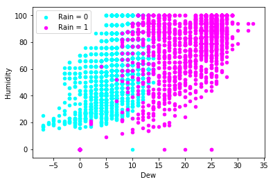

### Weather Prediction Model using Logistic Regression

This repository contains an implementation of a weather prediction model that utilizes logistic regression to make accurate weather forecasts. The model takes as input various meteorological features and outputs the probability of a given weather condition.

#### Mathematical Foundation

The mathematical foundation of the model involves the logistic function and the binary cross-entropy loss function. The logistic function, also known as the sigmoid function, is used to calculate the predicted probability of a weather condition based on input meteorological features. The binary cross-entropy loss function is used to minimize the difference between the predicted probability and the actual weather condition.

The logistic function is defined as:

$$ h_w(x) = \frac{1}{1 + e^{-w^T x}} $$

where `w` is the weight vector, `x` is the feature vector, and `e` is the base of the natural logarithm.

The binary cross-entropy loss function is given by the following equation:

$$ J(w) = -\frac{1}{m} \sum_{i=1}^{m} [y^{(i)} \log (h_w(x^{(i)})) + (1 - y^{(i)}) \log (1 - h_w(x^{(i)}))] $$

where `m` is the number of samples, `y` is the true label of the sample, and `h_w(x)` is the predicted probability that the sample belongs to class 1.

The goal of training the logistic regression model is to find the weights `w` that minimize the cost function `J(w)`. This can be achieved through an optimization algorithm such as gradient descent.

#### Data Preprocessing and Model Training

The meteorological features used as input to the model include temperature, humidity, wind speed, and barometric pressure, among others. These features are preprocessed and normalized to ensure that they are on the same scale and to reduce the impact of outliers.

The model is trained on a large dataset of historical weather data, and the training process involves updating the weights `w` so as to minimize the binary cross-entropy loss function `J(w)`. The optimization algorithm iteratively adjusts the weights until a minimum value of the loss function is obtained.

#### Results and Evaluations

The trained model is evaluated on a separate test dataset, and the results are compared with actual weather conditions to assess the accuracy of the model. One measure of accuracy is the receiver operating characteristic (ROC) curve, which plots the true positive rate against the false positive rate for different thresholds. A high-quality model will have an ROC curve that is close to the top-left corner of the plot, indicating a high true positive rate and a low false positive rate.

  

In this example, the ROC curve indicates a high degree of accuracy, with an area under the curve (AUC) of 0.97. This indicates that the model is able to accurately differentiate between the two weather conditions with a high degree of confidence.

#### Usage

The code for the weather prediction model can be found in the `Weather_prediction.ipynb` file in this repository. The code can be run using a Python interpreter, and the required dependencies can be installed using the `requ
